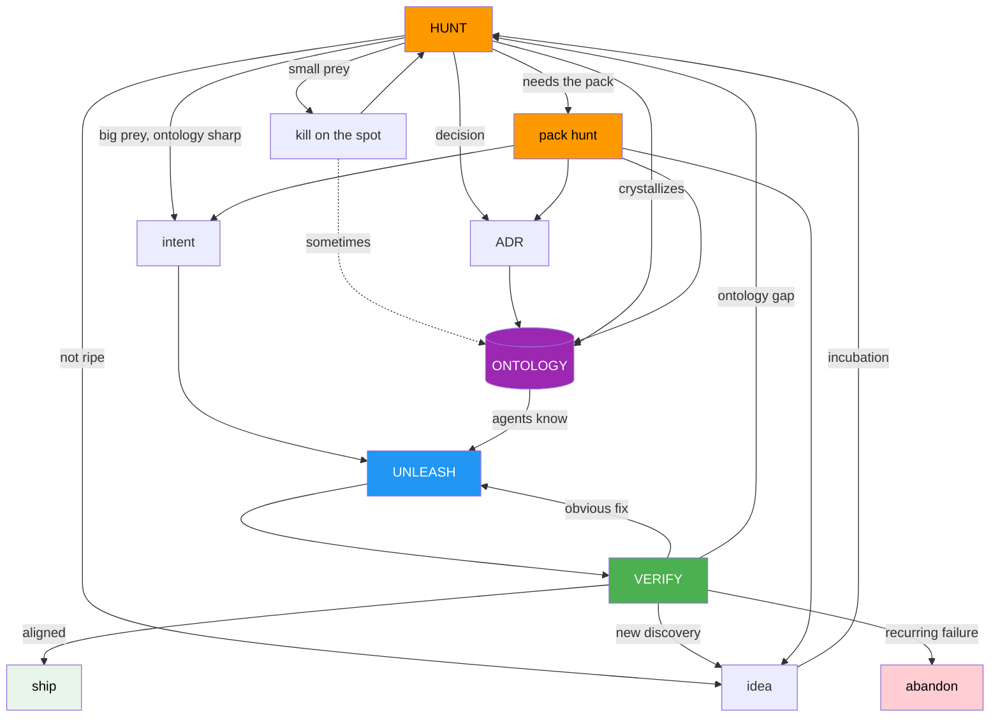

# The Hunt

A methodology for shipping software with AI agents.

Three modes. One shared contract. No bureaucracy during flow.

## The Metaphor

Think of it as a hunt.

**Hunters** are humans. You scout territory, track prey, make
decisions. Solo or as a pack with co-founders.

**Dogs** are AI agents. Powerful, fast, tireless. They run free
but hunt correctly because they've been trained. The training is
internalized — they don't need you holding a rope.

**Training** is the ontology. The shared understanding of what
exists, how it connects, what the rules are. Better training means
agents can be trusted with bigger prey.

**Unleash** means let go. Agents run free, governed by what they
know, not by you watching over them.

That's the shape. The rest of this document uses precise terms.

## Prerequisites

This methodology assumes a **cognitive environment** — an AI
partner with persistent memory, conversation search across sessions,
and access to your project knowledge. The AI partner is your working
memory extension, your long-term recall, and your context bridge
between sessions.

Today this means Claude with memory, project knowledge, and
conversation history. Tomorrow it might mean something else. The
methodology is tool-agnostic but environment-dependent.

## The Three Modes

### HUNT

You're in the cognitive environment, working. Exploring, deciding,
building, assessing. Everything fluid. The session is the unit.
Energy determines duration. Solo or with co-founders.

**Small prey** gets taken on the spot. README is wrong — fix it.
A term needs sharpening — sharpen it. No ceremony.

**Big prey** gets identified. Too complex for one session, or the
ontology isn't sharp enough yet. Park it as an idea. Sleep on it.
Come back when it's ripe.

HUNT outputs:

- **Finished work** — small prey, killed on the spot
- **Ideas** — captured for future hunts, not formalized
- **Decisions** (ADRs) — records of choices that shaped the ontology
- **Ontology updates** — entities, relationships, rules crystallized
- **Intents** — big prey described, ready for agents or co-founders

The ontology evolves as a byproduct of hunting, not as a separate
step. You make a decision and the ontology reflects it.

Rules:

- Follow the energy. Hunting different prey than planned is fine.
- If it requires creative thinking, you're still hunting. Don't
  unleash prematurely.
- What isn't captured doesn't survive. (See: Rituals.)

### UNLEASH

Agents and co-founders work autonomously, governed by the ontology.

They receive **intents**, not task lists. An intent describes the
prey: what it is, which part of the ontology governs it, how to
verify the catch. They plan their own approach, decompose into
tasks, execute.

With agents, you walk away. They might need ten attempts. You
check the result, not the process. With co-founders, execution
is more conversational — they'll push back, ask questions, refine
the intent mid-flight. Same mechanism, different feedback loop.

The gate between HUNT and UNLEASH:

**Is the ontology sharp enough for autonomous execution?**

Yes → write the intent, unleash. No → keep hunting.

### VERIFY

Check what came back. Does it match intent?

Not "is the code correct" but "is this what I meant?"

Four responses:

- **Aligned.** Ship it.
- **Misaligned, obvious fix.** Send them again.
- **Misaligned, ontology gap.** The definitions weren't sufficient.
  Next hunt sharpens the ontology. Unleash again.
- **New discovery.** The result revealed something unexpected.
  New idea. Feed it back to HUNT.

If the same ontology gap keeps recurring, the prey might be wrong.
Abandon the hunt. Not every prey is worth catching.

VERIFY also happens constantly inside hunt sessions. "Assess" is
VERIFY at a smaller timescale.

## The Ontology

The persistent contract that accumulates across cycles.

- HUNT sharpens it
- UNLEASH operates within it
- VERIFY reveals where it's insufficient

It defines:

- What entities exist and what they mean
- How entities relate to each other
- What rules govern them
- What to call them (naming is ontology, not style)

The ontology lives in **ONTOLOGY.md** — a single file, the source
of truth for the domain model. Three audiences:

- **You:** thinking tool and architecture reference
- **Agents:** internalized knowledge for autonomous operation
- **Co-founders:** shared contract for negotiation and alignment

Supporting files:

- **CONSTITUTION.md** — principles that constrain the ontology
- **AGENTS.md** — agent operating rules
- **CLAUDE.md** — Claude Code-specific extensions
- **decisions/** — ADRs recording why the ontology is shaped this way

## Pack Hunts

When work requires co-founders or collaborators, two things change.

**Onboarding.** People outside the cognitive environment need the
ontology as their entry point. ONTOLOGY.md and CONSTITUTION.md
orient them in twenty minutes. They don't need your conversation
history. They need the map.

**Negotiation.** Co-founders don't just read the ontology. They
challenge it. "I disagree that this entity is optional." "This
relationship should be event-driven." That debate IS the hunt.
The ontology is the shared canvas where alignment happens. Without
it, people leave a sprint with different understandings of what
they agreed on.

After consensus, co-founders receive intents — same as agents.
They have judgment where agents need precision, but the mechanism
is the same: intent + ontology = autonomous execution.

## The Cycle



Multiple timescales, simultaneously:

- **Minutes:** question → build → assess (within a session)
- **Days:** hunt Sunday → unleash Monday → verify Tuesday
- **Weeks:** park idea → incubate → hunt when ripe

Multiple hunts can be active at different stages of ripeness.

## Artifacts

### Ideas

Parked hunt output. Lightweight. A few lines: what you noticed,
why it might matter, where it connects. Just enough that future-you
picks up the scent.

Live in the project. Low bar. No expectation of action.

When an idea is ripe, it becomes a hunt. You open it, explore it,
sharpen the ontology around it. If the ontology gets sharp enough,
write an intent and unleash. If not, park it again. Some ideas
ripen in days. Some take weeks. Some never ripen.

### Intents

Prey descriptions for agents and co-founders. Thin by design —
the ontology carries the structural detail, the intent just
points at it.

```markdown
# [What you want to exist]

## Intent
What this is and why it matters.

## Ontology
Which entities, relationships, and rules govern this.
Reference ONTOLOGY.md sections.

## Done when
Observable outcomes. Not implementation steps.
```

You describe the target. They figure out the how.

### Decisions (ADRs)

Why the ontology is shaped this way. Emerge during hunts, during
verify, during pack debates. Sediment that accumulates.

### ONTOLOGY.md

Single file. Entities, relationships, rules, naming. The contract.
Evolves every cycle.

## Rituals

Two. Only two.

### Pick up the scent (session start)

What's alive? What has energy today?

Entry points — not a priority list, energy decides:

- Ideas — something might be ripe now
- Intents in progress — output to verify
- The ontology — something might need sharpening
- Conversation history — the AI partner remembers

Don't deliberate. Pick whatever pulls you. Go.

### Tag what you caught (session end)

Five minutes. Not formalizing — tagging.

- Ideas parked? → idea files
- Decisions made? → ADRs
- Ontology sharpened? → committed
- Work identified? → intent files
- Nothing concrete? → fine, the hunt informed your thinking

**The cost of skipping this:** Context loss. Dead ideas. Repeated
exploration. Tomorrow-you is a stranger. The ontology and repo are
the only things that survive between sessions. What isn't written
into them doesn't exist.

This is the one discipline the methodology demands.

## Why This Shape

This methodology mirrors how AI-human collaboration actually works
at the session level.

Humans are good at: exploration, pattern recognition, judgment,
creative leaps, deciding what matters. Bad at: holding context
across sessions, formalizing while thinking, sustaining energy on
demand, decomposing work into steps before understanding the shape.

AI partners are good at: holding context within sessions, searching
across sessions, executing decomposed work, maintaining consistency
with an ontology. Bad at: deciding what matters, knowing when to
abandon, creative judgment under ambiguity.

The methodology puts each where they're strong:

- **HUNT** is human-led. Exploration, judgment, creative decisions.
- **UNLEASH** is agent-led. Execution within known constraints.
- **VERIFY** is human-led. Alignment judgment.
- **The ontology** is the bridge. Humans shape it, agents consume it.

The two rituals exist because the session boundary is where context
dies. The AI partner remembers within a session. The ontology and
repo survive between sessions. Everything else is lost.

Energy-following isn't a concession to human weakness. It's how
you get the best signal about what's ripe. Forcing a predetermined
order produces compliance, not insight. The methodology bends to
energy because energy contains information about readiness.
